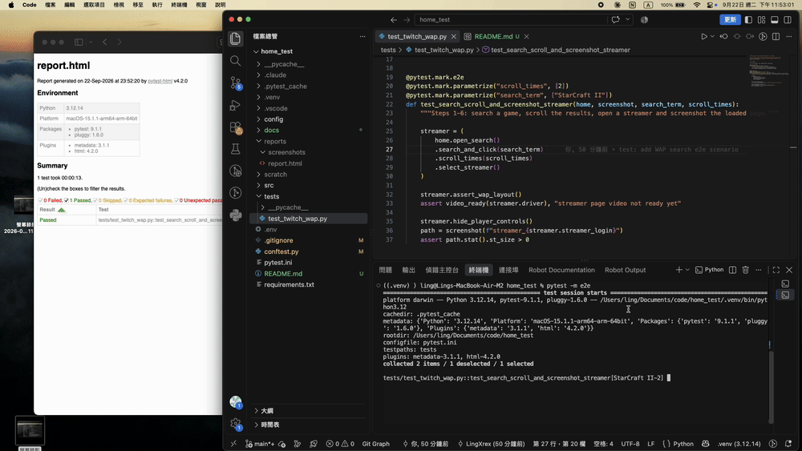

# Twitch WAP Automation

UI test framework for the Twitch mobile web site (`m.twitch.tv`), built with **Python + Selenium + pytest** and run on **Chrome's mobile emulator**.



## Scenario

| Step | Description | Where it happens |
|---|---|---|
| 1 | Go to Twitch | `home` fixture → `HomePage.open()` |
| 2 | Click the search icon | `HomePage.open_search()` |
| 3 | Input *StarCraft II* | `SearchPage.search_and_click()` |
| 4 | Scroll down 2 times | `SearchResultsPage.scroll_times(2)` (recursive) |
| 5 | Select one streamer | `SearchResultsPage.select_streamer()` |
| 6 | Wait until everything is loaded, take a screenshot | `StreamerPage.wait_until_loaded()` + `screenshot` fixture |

Pop-ups are dismissed on every page load and re-checked on the streamer page until the video plays; an unrecognised modal fails the test with its name (see [Pop-up handling](#pop-up-handling)).

## Requirements

- Python 3.12
- Google Chrome (ChromeDriver is downloaded automatically by Selenium Manager)

## Setup

```bash
python3.12 -m venv .venv
source .venv/bin/activate
pip install -r requirements.txt
```

## Running the tests

```bash
pytest                          # all tests
pytest -m smoke                 # WAP layout check only (~6s)
pytest -m e2e                   # the 6-step scenario
pytest --headless               # no browser window
pytest --device iPhone_X        # another device profile
```

### Options

CLI flags take precedence over environment variables, which take precedence over defaults.

| CLI flag | Env var | Default | Description |
|---|---|---|---|
| `--device` | `DEVICE` | `Pixel_8` | Device profile from `config/devices.py` |
| `--headless` | `HEADLESS` | off | Run Chrome without a window |
| | `TIMEOUT` | `10` | Explicit wait timeout (s) |
| | `PAGE_LOAD_TIMEOUT` | `10` | Page load timeout (s) |
| | `SCREENSHOTS_DIR` | `reports/screenshots` | Where screenshots are written |
| | `BASE_URL` | `https://m.twitch.tv/` | Site under test |

### Output

| Path | Content |
|---|---|
| `reports/report.html` | Self-contained HTML report with screenshots embedded |
| `reports/screenshots/` | Screenshots taken by tests (`<timestamp>_<name>.png`) |
| `reports/screenshots/failures/` | Automatic screenshot of the browser when a test fails |

## Project structure

```
config/
  devices.py            device profiles for mobile emulation (single source of truth for the device)
  settings.py           run configuration: CLI flag > env var > default
  report.css            pytest-html style override for portrait screenshots
src/
  core/                 site-agnostic framework code
    driver_factory.py   Chrome with mobileEmulation
    base_page.py        page object base: "loaded" definition, element primitives, WAP guard
    waits.py            explicit waits and page conditions (no sleep-based waiting)
    retry.py            narrow retry for stale / intercepted elements
    screenshot.py       named, timestamped screenshots
  components/
    popup_handler.py    recursive pop-up dismissal
  pages/                Twitch page objects
    twitch_page.py      base for Twitch pages: pop-up handling on by default
    home_page.py
    search_page.py
    search_results_page.py
    streamer_page.py
tests/
  test_twitch_wap.py    smoke + e2e scenario
conftest.py             CLI options, fixtures, failure screenshots
pytest.ini
requirements.txt
```

Dependencies only point downwards: `config → core → components → pages → tests`. `core` has no Twitch knowledge; pop-up handling reaches `BasePage` through a `PopupDismisser` protocol, so a new site only needs new `pages/` and `components/`.

## Design notes

### Mobile emulation (WAP, not desktop)

ChromeDriver's `mobileEmulation` sets the device metrics and `clientHints` (`platform`, `mobile: true`), so Chrome derives a mobile user agent that matches its real version. iOS profiles also set an explicit user agent, since ChromeDriver cannot infer one for iOS.

Every test asserts it got the WAP site: host is `m.twitch.tv` and the layout viewport (`clientWidth`) equals the device width. `clientWidth` is used instead of `innerWidth` because Twitch briefly overflows horizontally while hydrating, which inflates `innerWidth`.

### What "loaded" means

`page_load_strategy = "eager"` is used because Twitch autoplays live video and the `load` event is unreliable. Each page object instead waits for an explicit definition:

1. `document.readyState == "complete"`
2. layout settled (no horizontal overflow)
3. pop-ups dismissed
4. a page-specific element visible

The streamer page additionally waits until the `<video>` has a decoded frame and every on-screen image has finished decoding. Before the screenshot the player controls are collapsed so they do not dim the frame.

### Recursion

- **`PopupHandler.dismiss_all(depth)`**: dismisses the first visible pop-up, then solves the same problem on the new DOM, because closing one pop-up can reveal another. Base cases: nothing visible (done), an unknown modal (fail with its label), or the depth limit (fail instead of looping forever).
- **`SearchResultsPage.scroll_times(n)`**: scrolls one viewport, waits until it really moved and cards are rendered, then solves `n - 1`. The list is infinite and virtualised, so progress is measured by scroll position rather than card count.

### Pop-up handling

Pop-ups are data, not code: each one is a `Popup(name, container, dismiss)` entry in `KNOWN_POPUPS`. Supporting a new one is a one-line addition, with no page or test changes.

- Every page dismisses pop-ups while loading (`TwitchPage` wires the handler in by default).
- On the streamer page the check repeats on every poll until the video renders, because player interstitials can appear after the page itself has loaded.
- Any visible `aria-modal` that is not in `KNOWN_POPUPS` fails the test with its label, so an unhandled pop-up is reported instead of silently blocking clicks.

### Locators

Priority: `data-a-target` > `aria-label` / `role` > structure. Twitch's CSS class names are hashed and never used. The UI language is pinned to `en-US` so text and `aria-label` locators are stable.

## Known limitations

- **Search icon**: logged-out mobile Twitch no longer shows a magnifier in the top bar, so step 2 uses the bottom navigation's *Browse* icon (also a magnifier), which opens the page with the search input.
- **Step 3**: after typing, the first suggestion is opened instead of pressing Enter. Enter leads to the "Top" results, which list only a few channels; after two scrolls there is no streamer left to select. For a game name such as *StarCraft II* the first suggestion is the game's category page of live streams.
- **Which streamer**: the selected streamer depends on Twitch's live ranking at run time; the test asserts the outcome (a channel page with a playing video), not a specific streamer.
